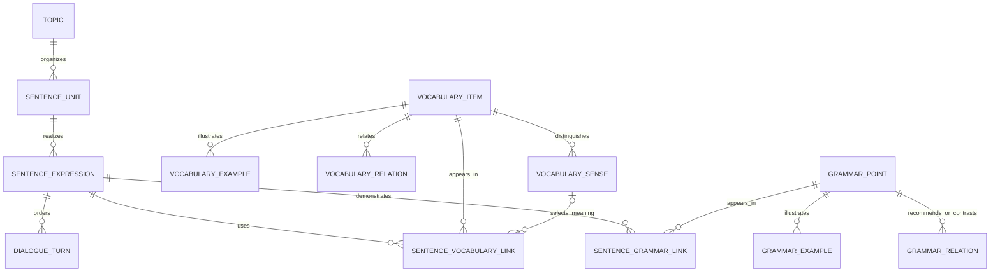

# Learning Architecture V2 — Phase 3.5A

Vocabulary, Grammar and Sentences/Expressions are separate first-class domains. Vocabulary and Grammar identities belong to one language. Only the Chinese communicative Sentence unit can group English and Japanese expressions. No shared lexical IDs, paired grammar IDs, inferred equivalence or learner-state changes are introduced.

## Schema ownership

All names below have the `v2_` prefix; none extends or reuses a legacy authoritative table.

| Table | Responsibility |
|---|---|
| vocabulary_items | One language's lexical identity, lemma, word/fixed_expression, part of speech, Stage, IPA or reading, register, publication, ordering |
| vocabulary_senses | Chinese meaning and usage boundary, semantic label, register note, justified optional Stage override |
| vocabulary_examples | Sense-aware example/collocation/pattern text, Chinese translation/note and optional structured reading |
| vocabulary_relations | Directed same-language synonym, near_synonym, antonym, commonly_confused or related edges with distinction notes |
| vocabulary_topics | Optional topic membership; Stage remains the primary vocabulary organization |
| grammar_points | Independent language library, slug, Chinese title, form name, Level, core, purpose, formula, use conditions, mistakes, nuance and usage |
| grammar_examples | Reusable target text and Chinese explanation; optional same-language source expression, reading and English IPA |
| grammar_relations | Directed prerequisite and related/contrast/confusion/formality edges |
| topics | Independent V2 life-topic labels, without changing existing Topics |
| sentence_units | Chinese semantic anchor, topic, sentence/scenario/dialogue type, context and explicit comparison note |
| sentence_expressions | Independent language realization and variants, register, readings, publication and three difficulty dimensions |
| dialogue_turns | Ordered speaker/text/reading records owned by a dialogue expression |
| sentence_vocabulary_links | Actual lexical item and optional owned sense, visible form, occurrence, optional dialogue turn, importance and new-target flag |
| sentence_grammar_links | Actual grammar point used, visible form, occurrence, optional turn and local usage note |

There are 14 V2 tables. Core relationships are relational, not embedded JSON. JSON is restricted to ordered reading segments such as `[{"text":"食べ","reading":"たべ"},{"text":"ていません。"}]`; plain segments omit `reading`. Pronunciation is display metadata, not a second searchable source of lexical identity. EN lexical IPA and JA lexical reading occupy independent optional fields. The fixture supplies them for every lexical item. Sentence and grammar IPA are optional.

## Vocabulary and grammar progression

Both languages independently use Vocabulary Stage 1–6 and Grammar Level 1–6. These are practical editorial scales, not CEFR/JLPT equivalents, frequency certificates or psychometric measurements. Equal numbers across languages do not claim equivalent structures or ability.

| Band | Editorial vocabulary interpretation | Editorial grammar interpretation |
|---|---|---|
| 1 | Very familiar, immediately useful meanings | Basic statements and frequent elementary forms |
| 2 | Common daily actions, combinations and meanings | Frequent questions, inflections and combinations |
| 3 | Broader everyday senses and fixed expressions | Common aspect, modality and connected meanings |
| 4 | More nuanced, less familiar or stronger register-dependent meaning | More complex temporal, explanatory or conditional structures |
| 5 | Less frequent or formal vocabulary with narrower uses | Subtle combinations and discourse-sensitive structures |
| 6 | Advanced practical lexical distinctions | Advanced productive distinctions and contextual nuance |

Editors consider usefulness/frequency, semantic complexity, register, morphology and learner familiarity. A sense normally inherits the item Stage. An override requires a reason; the example `expect` distinguishes prediction from a behavior requirement. `look forward to` has its own identity and pleasant-anticipation meaning. A lexical relation does not merge meanings. `plan` in the fixture is a verb; noun `plan` would be another item distinguished by part of speech.

Grammar explanations occupy named fields suitable for 核心感觉、基本结构、什么时候使用、常见错误 and nuance. Examples and relations are separate reusable records. For `type=prerequisite`, **source requires target**; `ja-te-iru → ja-te-form` recommends knowing て形 first. Recursive triggers reject cycles on insertion and updates. These edges never block browsing or APIs. Other relations are also directed; API details include incoming/outgoing direction. A reverse prerequisite is reported as `recommended_for`, not as a prerequisite.

## Semantic expressions and difficulty

Sentence unit types are only `sentence`, `scenario` and `dialogue`. A scenario requires a nonempty Chinese context and can have multiple natural response expressions. Dialogue expressions contain a readable whole-dialogue text plus ordered speaker turns; turns are the authoritative segments for turn-level links. Content validation ensures matching readings and visible chunks. Editors must keep the whole-dialogue text in sync with turns. This is bounded teaching dialogue, not chat infrastructure.

Each expression independently stores `vocabulary_difficulty`, `grammar_difficulty` and `overall_difficulty`, integer 1–6. Overall difficulty is a mandatory editorial judgment with a required rationale, never automatically computed as max or average. Communicative inference, turn length and interacting structures can increase overall load; a familiar chunk can make a difficult grammar form easier to use. No learner coverage calculation or recommendation score is implemented.

`not-eaten` shares 我还没吃饭。 across:

| Language | Expression | Vocabulary / grammar / overall | Actual links |
|---|---|---|---|
| EN | I haven't eaten yet. | 1 / 4 / 3 | eat, yet; Present Perfect |
| JA | まだ食べていません。 | 1 / 3 / 2 | まだ, 食べる; ている and polite negative |

Japanese まだ + ている in the negative expresses that eating has not occurred up to now; it does not claim an ongoing eating action. `いません` is the polite negative of auxiliary `いる`, following the lexical verb's て形. The shared communicative meaning does not identify Japanese aspect with English Present Perfect.

`changed-plan` groups I was going to go, but something came up. and 行くつもりだったんですが、急に用事ができました。 EN has vocabulary/grammar/overall 3/4/4; JA has 3/4/5. The English past intention and simple-past event links differ from Japanese つもりだった, んですが and ました. Japanese overall load includes the combined background explanation and event report.

The fixture also shows a lexically difficult but grammatically simple expression (`I am exhausted.`), an easy-lexicon/harder-grammar expression, a scenario variant, dialogue links, fixed expressions, multiple senses, a prerequisite and grammar contrast. 12 semantic units, 25 expressions, 33 lexical items (16 EN / 17 JA), 34 senses and 19 grammar points (9 EN / 10 JA) are examples only. Vocabulary/grammar coverage is intentionally incomplete; omitted function words or structures are not claimed absent or already learned.

## Relationships and integrity

Composite `(id,language)` foreign keys reject cross-language sentence–vocabulary, sentence–grammar, lexical relations, grammar relations and grammar-example source links. `(sense_id,item_id)` guarantees sense ownership. `(turn_id,expression_id)` prevents attaching a link to another dialogue. Foreign-key parents are unique; delete/update defaults restrict removal of referenced content. A nullable sense means item-level use, not unknown ownership of a non-null sense.

Constraints cover Stage/Level/difficulty range and integer type, enums, primary variants, lexical identity by language+lemma+part of speech, grammar slug within language, sense override rationale, relation self-edges and duplicate link occurrences. Dialogue ownership survives changes to turns, expressions and unit type through triggers. A partial unique index allows at most one primary expression per unit/language; a draft unit may have no expressions. Editors must ensure a published language has a primary expression and valid complete display metadata before publishing; there is no authoring API in this phase.

Browse indexes follow publication/language/stage or level; unit/topic/type and expression difficulty indexes support Sentence filtering. Reverse indexes start with item/grammar ID. Expression-unit and example/sense owner indexes support detail queries. Link uniqueness includes nullable sense/turn normalized to empty string. Stable IDs in this contract are lowercase ASCII slugs; readings and visible text remain Unicode.

Span metadata uses the exact `displayed_form` plus a 1-based **nonoverlapping literal occurrence**, optionally scoped to a turn. There are no UTF-8 byte or UTF-16 code-unit offsets. The same chunk can identify an inflected surface form such as eaten → eat. This avoids Unicode offset ambiguity but is not tokenization: the literal `go` can also occur inside `going`; the final go in the changed-plan fixture is occurrence 2. Editors should prefer larger unambiguous chunks. An edit of visible text requires revalidating all linked chunks. Tests validate each fixture occurrence and reading reconstruction. Discontinuous grammatical structures can use a larger continuous chunk or separate rows; no automatic parser is claimed.

## Boundary and known limitations

Only `src/worker-v2.js` routes V2. It delegates all other requests and scheduled behavior to the unchanged legacy Worker. The dedicated staging configuration has no cron to avoid adding unrelated scheduled activity; legacy request-time session expiry remains functional. The original entry point, UI, learner state, placement, recommendation, checkpoints, configs and migrations are unchanged. Only `public/` is deployed as assets.

No authoring UI, progress transfer, bulk curriculum, audio, AI, accounts or final V2 UI exists. Search is parameterized SQLite LIKE over Chinese/target text; no stemming, kana normalization, ranked full text or embeddings. Detail subcollections are appropriate for an editorially bounded single item; very large future relation libraries may require pagination beyond the already paginated reverse-expression lists. Stages, levels, semantic annotations and future mapping require editorial judgment, not automatic equivalence.
